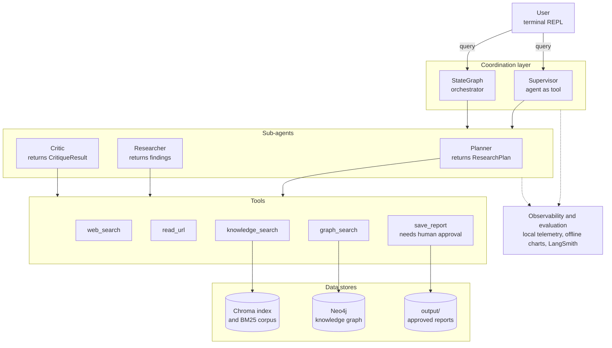
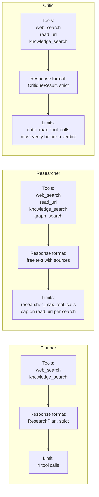

# MA_systems_hl8

A multi-agent research system that runs in the terminal. You ask a research
question, and four agents work together to answer it. The system searches the
web and a local knowledge base, checks its own findings, and saves a report
only after you approve it.

The project is built with LangChain, LangGraph and LangSmith. The language
model is `gpt-4.1-mini` from OpenAI.

## What the system does

The work follows one loop: **Plan, Research, Critique**. This is the
evaluator-optimizer pattern. One agent produces the result, and another agent
judges it. If the judgement is negative, the work goes back for another round
with a concrete list of comments.

- The **Planner** turns your question into a structured plan.
- The **Researcher** follows that plan and collects findings with sources.
- The **Critic** checks those findings with the same tools and returns a
  verdict along three dimensions: freshness, coverage and structure.
- The **coordinator** drives the loop and saves the final report.

Nothing reaches the disk on its own. When the system wants to save a report,
it pauses and shows you the file name and a piece of the content. You then
choose to approve the write, ask for a revision with your own comment, or
cancel it.

The system ships with two coordinators that do the same job in different ways.
The first one treats each agent as a tool and lets the model choose the order
of calls. The second one is an explicit state graph where the order and the
round limit are part of the structure. You pick the path with a command line
flag, and both paths use the same agents and the same tools.

### Overall architecture of the system



## The agents

The same factory function builds all three sub-agents, but each one gets a
different set of tools, a different response format and different limits.

The Planner and the Critic return structured objects in strict mode. If the
model leaves a required field empty, the system notices it instead of
accepting an incomplete result. The Researcher is the only agent that returns
free text, because its work is later checked by the Critic.

Only the Researcher can use the knowledge graph. The Planner needs breadth
rather than a fourth tool, and a wider tool set for the Critic would only give
it more room to approve work without a real check.

No sub-agent keeps a memory of earlier calls. Each call receives one message
and returns one result. Because of this the coordinator always passes the
original user request to a sub-agent, and not only its own summary.

### Sub-agents and their tools



## Installation and use

You need Python 3.12, an OpenAI API key, and about 3 GB of free disk space for
the index and the reranking model. Docker is optional and only needed for the
knowledge graph.

### 1. Install

```bash
git clone https://github.com/felkost/MA_systems_hl8.git
cd MA_systems_hl8
python -m venv .venv
source .venv/Scripts/activate      # or the matching command for your platform
pip install -r requirements.txt -r requirements-dev.txt
```

### 2. Configure

```bash
cp .env.example .env
```

Open `.env` and fill in `OPENAI_API_KEY`. If you want traces in LangSmith, set
`LANGSMITH_API_KEY` as well and change `LANGSMITH_TRACING` to `true`. When
tracing is on and the key is missing, the system refuses to trace instead of
failing quietly.

Leave `CRITIC_PROMPT_VERSION=c2`. All quality numbers below were measured on
that version of the Critic prompt, and it is the default in the code.

### 3. Build the search index

```bash
python ingest.py                   # build the search index
```

This reads the PDF files in `data/`, splits them into fragments and writes a
Chroma index plus a corpus for keyword search. It runs once and takes a few
minutes. The agents never build the index themselves.

### 4. Run the system

```bash
python main.py                          # Supervisor path, the default
python main.py --orchestration graph    # explicit state graph path
```

Type your question at the `You:` prompt. When the system asks for approval,
answer with `approve`, `edit` or `reject`. With `edit` you also type a comment,
and the report is rewritten before the next approval request. Type `exit` or
`quit` to end the session. Approved reports appear in `output/`.

### 5. Optional: the knowledge graph

The knowledge graph is an extra source, not a required part. Without it the
system still works and `graph_search` simply returns an error string.

```bash
docker compose up -d               # starts the graph database
python ingest.py --graph           # builds the graph on top of the index
```

### 6. Evaluation and reports

```bash
python -m evals.run_eval                        # Supervisor path, end to end
python -m evals.run_eval --orchestration graph  # state graph path
python -m evals.run_eval --subagents            # Planner and Critic only
python reports.py                               # offline charts from local logs
```

The evaluation runs against a shared dataset in LangSmith, so results from
different runs can be compared. The `reports.py` script needs no network. It
reads the local telemetry files and writes a CSV file and seven charts.

### 7. Code quality checks

```bash
pytest -q --cov=.
black --check .
flake8 .
mypy .
```

## Measured quality

Every number below comes from real runs on a fixed set of 18 research
questions. Each configuration was run three times, because a single run of a
language model is a sample and not a final answer. The confidence intervals
group the data by question, and the main result was checked by three methods
that rest on different assumptions.

The clearest result is about the Critic prompt. The first wording asked for
approval when three checks were true. That left room for the model to approve
work and still list gaps in the same answer. The second wording allows
approval only when the three checks are true and the list of gaps is empty.
This change alone raised the internal consistency of the verdict from 0.667 to
0.954.

| Measurement | Result |
| --- | --- |
| Verdict consistency, first prompt wording | 0.667, interval [0.527; 0.806] |
| Verdict consistency, second prompt wording | 0.954, interval [0.885; 1.000] |
| Paired gain over 18 questions | 0.287, interval [0.148; 0.426] |
| Questions improved, unchanged, worse | 11, 7, 0 |
| Supervisor path in the final configuration | 0.972, interval [0.914; 1.000] |
| Difference between the two paths | 0.018, interval [-0.067; 0.104], not significant |
| Cost per example | $$0.0178$ Supervisor, $0.0144 graph, 19 percent cheaper |
| Tokens per example | 50 523 Supervisor, 47 453 graph, 6 percent fewer |
| Runs that ended without saving the report | 4 of 18 on the Supervisor path, 0 of 108 on the graph path |
| Revision convergence at a budget of 1, 2 and 3 rounds | 0.94, 0.78, 0.72 on the Supervisor path, 1.00 on the graph path |

## Limits and risks

The system is fit for the use described here. The list below is what is still
open, with the next step for each item.

| Risk | Next step |
| --- | --- |
| The coordinator can finish a run without saving the report | Add middleware that repeats the turn once when the expected call is missing |
| The Critic can pass a check in form without doing it in substance | Measure verdict consistency for every new prompt wording before using it |
| Parallel calls can break a line in the telemetry log | Synchronise at the point of writing; readers already skip a damaged line |
| A run with human approval produces two root traces | Close the execution stream before resuming after the pause |
| About half of the extracted graph relations are noise | Use a larger text window per extraction and a confidence threshold |
| Outside text can reach the model through page reading and web search | Human approval covers the only write; consider cleaning text before use |
| The evaluation platform has its own spending limit on traces | Check the remaining limit before a large matrix of experiments |
| Heavy jobs can exhaust the memory of a development machine | Run each experiment cell in its own process, as the matrix runner does |
| Saturated evaluators cannot tell configurations apart | Check that the chosen evaluators still have room before a new experiment |
| On the state graph path, `edit` behaves like `reject` | Add a return loop to the write node |
| The coordinator state does not survive a process restart | Move to a state store that survives a restart |
| The question set was written by the author of the project | Read the results as valid for similar research requests, not for any request |

## Full documentation

The report describes the architecture, the tested scenarios, the statistics
behind the numbers above, the problems found during the work and the reasons
for each design choice.

- [report/report_en.pdf](report/report_en.pdf) — the full report in English.
- [report/report_ua.pdf](report/report_ua.pdf) — the same report in Ukrainian.

## License

[MIT](LICENSE)
